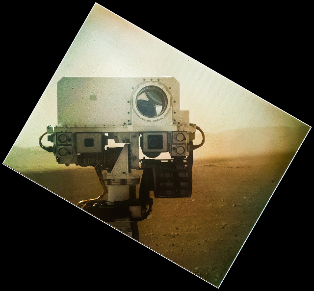
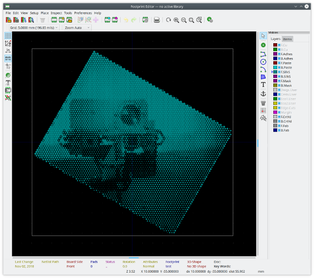

# kicad_halftone
Turns raster images in to PCB silkscreen images using halftone technique

I've been meaning to learn Rust for ages; this is a mainly a toy project towards that.  See my [post on an earlier iteration](http://ianrrees.github.io/2018/06/20/pcb-graphics-with-kicad-+-gimp.html) for some background.

 to 

Still a work in progress, when I've got some free time and feel like programming...

## Building

  1. Clone this repo
  2. Install Rust and cargo
  3. `$cargo build`

## Using
```
$ cargo run -- --help
    Finished dev [unoptimized + debuginfo] target(s) in 0.04s
     Running `target/debug/kicad_halftone --help`
Usage:
  target/debug/kicad_halftone [OPTIONS] INPUT

Generate KiCad footprints from bitmaps, using halftone technique. At least one
of output width and output height needs to be specified. If one is specified,
then the input image's aspect ratio will be preserved, but if both are
specified the image will be scaled to fit.

Positional arguments:
  INPUT                 Raster image source

Optional arguments:
  -h,--help             Show this help message and exit
  -o,--output OUTPUT    Output file name - defaults input base name
  -s,--spacing SPACING  Spacing between dots [mm]
  -d,--dot-min DOT_MIN  Minimum diameter of dots [mm]
  -D,--dot-max DOT_MAX  Maximum diameter of dots [mm]
  -w,--width WIDTH      Output width [mm]
  -h,--height HEIGHT    Output height [mm]
  -i,--invert           Invert image brightness
  -g,--gui              Launch GUI (if support is available)
```
