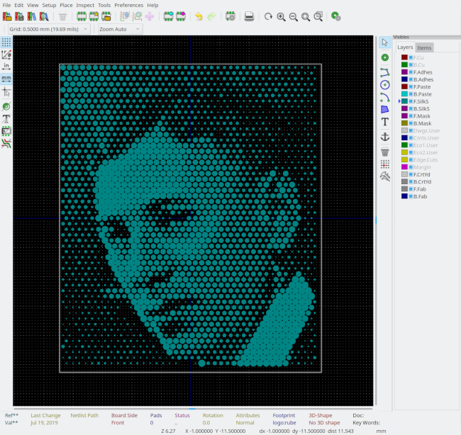

# kicad_halftone
Turns raster images in to PCB silkscreen images using halftone technique

I've been meaning to learn Rust for ages; this is a mainly a toy project towards that.  See my [post on an earlier iteration](http://ianrrees.github.io/2018/06/20/pcb-graphics-with-kicad-+-gimp.html) for some background.





Still a work in progress, when I've got some free time and feel like programming...

## Building

  1. Clone this repo
  2. Install Rust and cargo
  3. `$cargo build`

## Using
```
kicad_halftone$ cargo run -- --help
    Finished dev [unoptimized + debuginfo] target(s) in 0.14s
     Running `target/debug/kicad_halftone --help`
kicad_halftone 0.1.0
Ian Rees <ian.rees@gmail.com>
Generate KiCad footprints from bitmaps, using halftone technique.  At least one of output width and output height needs
to be specified.  If one is specified, then the input image's aspect ratio will be preserved, but if both are specified
the image will be scaled to fit.

USAGE:
    kicad_halftone [FLAGS] [OPTIONS] [ARGS]

FLAGS:
        --help
            Prints help information

    -i, --invert
            Invert image brightness

    -V, --version
            Prints version information


OPTIONS:
    -D, --dot-max <dot_max_diam>
            Maximum diameter of dots [mm]

    -d, --dot-min <dot_min_diam>
            Minimum diameter of dots [mm]

    -s, --spacing <dot_spacing>
            Spacing between dots [mm]

    -h, --height <output_height>
            Output height [mm]

    -w, --width <output_width>
            Output width [mm]


ARGS:
    <INPUT>
            Raster image source

    <OUTPUT>
            Output file name - defaults input base name
```
